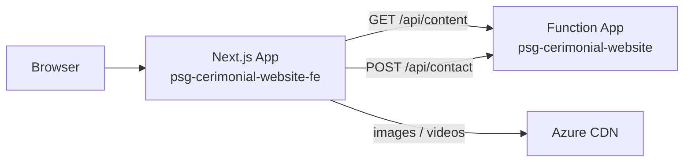

# Patricia Garcia Cerimonialista — Website

Modern marketing site for **Patricia Garcia Cerimonialista**, built with Next.js. Content is loaded from a remote API, sections are interactive and mobile-friendly, and the contact form submits securely through a server action.

**Production:** [psg-cerimonial-website-fe.azurewebsites.net](https://psg-cerimonial-website-fe.azurewebsites.net)

---

## Highlights

- **Single-page experience** — Header, services, process, technology, gallery, testimonials, team, and contact on one scrollable page
- **API-driven content** — Copy, images, videos, and team data come from the PSG backend (no hard-coded business text)
- **Interactive sections** — Clickable cards, carousels, and detail panels with smooth transitions; auto-advance every 5 seconds
- **Performance-first** — ISR caching, optimized images (AVIF/WebP), lazy media, carousel windowing, deferred header video
- **Secure contact flow** — Form posts via Next.js Server Action; API keys never reach the browser
- **Azure-ready** — Standalone build output for App Service deployment

---

## Tech stack

| Layer | Technology |
|--------|------------|
| Framework | [Next.js 16](https://nextjs.org) (App Router, Server Components, Server Actions) |
| UI | [React 19](https://react.dev), [Tailwind CSS 4](https://tailwindcss.com) |
| Language | TypeScript |
| Fonts | Lato + Montserrat (`next/font`) |
| Hosting | Azure App Service (Linux, Node 22) |
| CDN / media | Azure CDN (`psg-cdn-perf-two.azureedge.net`) |
| Backend API | Azure Function App (`psg-cerimonial-website`) |

---

## Architecture



1. **Page load** — Server fetches site content with ISR (`revalidate: 300s`), normalizes URLs, and renders static HTML where possible.
2. **Interactivity** — Client components handle carousels, section navigation, and form UX.
3. **Contact** — `ContactForm` calls `submitContactForm` (server action), which forwards the payload to the contact API with server-only credentials.

---

## Page sections

| Section | ID | Behavior |
|---------|-----|----------|
| Início | `#inicio` | Logo, optional background video, social links, section nav |
| Nossos Serviços | `#servicos` | Service cards + description carousel |
| Como Funciona | `#como-funciona` | Circular step selector + detail panel |
| Tecnologia e Inovação | `#tecnologia-inovacao` | Solution cards + optional demo video |
| Galeria de Momentos | `#galeria` | Main carousel, thumbnails, lightbox modal |
| Depoimentos | `#depoimentos` | Client testimonials |
| Nossa Equipe | `#equipe` | Team members |
| Fale Conosco | `#contato` | Contact form with validation and feedback |

---

## Getting started

### Prerequisites

- **Node.js 20+** (22 recommended for production parity with Azure)
- **npm**
- API credentials for content and contact endpoints

### 1. Clone and install

```bash
git clone <repository-url>
cd cerimonial-psg
npm ci
```

### 2. Environment variables

Copy the template and fill in your values:

```bash
cp .env.example .env.local
```

| Variable | Required | Description |
|----------|----------|-------------|
| `CONTENT_API_URL` | Yes | Content API base URL |
| `CONTENT_API_CODE` | Yes | Function key for content endpoint |
| `CONTACT_API_URL` | Yes | Contact API base URL |
| `CONTACT_API_CODE` | Yes | Function key for contact endpoint |
| `DIGITAL_SOLUTIONS_VIDEO_FALLBACK_URL` | No | Used when the API returns an empty video URL |

> Never commit `.env.local`. Only `.env.example` (placeholders) belongs in git.

### 3. Run locally

```bash
npm run run:local
```

Open [http://localhost:3000](http://localhost:3000).

`run:local` frees port 3000, clears `.next/`, and starts the dev server with Turbopack.

### 4. Production-like local test

```bash
npm run run:prod
```

Builds with standalone output and runs `next start` — closest match to Azure behavior.

---

## npm scripts

| Script | Description |
|--------|-------------|
| `npm run dev` | Development server |
| `npm run build` | Production build |
| `npm run start` | Serve production build |
| `npm run run:local` | Kill stale processes → clean → `next dev` |
| `npm run run:prod` | Kill stale processes → clean → build → start |
| `npm run clean` | Remove `.next/` |
| `npm run kill` | Free port 3000 (fixes orphaned `next` processes) |
| `npm run lint` | ESLint |
| `npm run deploy:azure:fe` | Deploy to Azure App Service (requires local `scripts/` — not in repo) |

---

## Project structure

```text
cerimonial-psg/
├── src/
│   ├── app/
│   │   ├── actions/contact.ts    # Server Action — contact form POST
│   │   ├── layout.tsx            # Root layout, fonts, metadata
│   │   ├── page.tsx              # Home page (all sections)
│   │   ├── globals.css           # Theme, animations, transitions
│   │   └── error.tsx             # Client error boundary
│   ├── components/               # UI sections and icons
│   ├── hooks/useAutoAdvance.ts   # 5s carousel auto-advance
│   ├── lib/content.ts            # API fetch, ISR, URL sanitization
│   └── types/content.ts          # API response types
├── docs/
│   ├── DEPLOY-AZURE.md           # Azure App Service deployment
│   └── sync-dns-domain.md        # Custom domain + DNS + HTTPS
├── next.config.ts                # Standalone output, images, cache headers
└── .env.example                  # Environment template
```

---

## Deployment

The frontend runs on **Azure App Service** (`psg-cerimonial-website-fe`) in resource group `psg-cerimonial-website`. The backend API remains on the separate Function App (`psg-cerimonial-website`).

Detailed guides:

- **[docs/DEPLOY-AZURE.md](./docs/DEPLOY-AZURE.md)** — Create App Service, env vars, deploy zip / standalone
- **[docs/sync-dns-domain.md](./docs/sync-dns-domain.md)** — Point `studioarteventos.com.br` (or your domain) to Azure + SSL

Quick deploy (if you have local scripts):

```bash
export APP_NAME=psg-cerimonial-website-fe
export RESOURCE_GROUP=psg-cerimonial-website
npm run deploy:azure:fe
```

Set the same environment variables in **Azure Portal → App Service → Configuration → Application settings**.

---

## Performance & caching

- **ISR** — Content revalidated every 5 minutes (`src/lib/content.ts`)
- **HTML cache** — `Cache-Control: public, s-maxage=300, stale-while-revalidate=86400` on `/`
- **Images** — `next/image` with AVIF/WebP, 7-day `minimumCacheTTL`, remote CDN patterns
- **Header video** — Loaded only when in viewport; skipped on slow connections / data-saver
- **Gallery** — Carousel windowing (only adjacent slides in DOM); CDN fallback when optimizer fails on large files
- **Standalone build** — Minimal Node footprint for Azure (`output: "standalone"`)

---

## Contact form & logging

Submissions go through `submitContactForm` (server-only). On failure, structured JSON logs are written server-side (`contact_form` scope) — visible in **Azure Log stream**. Client-side errors are logged to the browser console without exposing secrets or message bodies.

---

## Troubleshooting

| Issue | Fix |
|-------|-----|
| Port 3000 in use / broken JS on mobile | `npm run kill` then `npm run run:local` or `run:prod` |
| Page loads but no interactivity | Stale `next start` on 3000 while dev build is stale — always `kill` + `clean` before switching modes |
| Application Error on Azure | Check App Service logs; verify `CONTENT_*` and `CONTACT_*` app settings |
| Broken gallery thumbnails | Large originals may fail image optimizer; component falls back to direct CDN URL |
| Azure quota error in Brazil South | Deploy App Service in **West Europe** or **East US** (see deploy docs) |

---

## Security

- API keys live in `.env.local` (local) or Azure App Settings (production) — never in client bundles
- `server-only` guard on content fetching module
- Contact form validated on server before API call
- `.gitignore` excludes `.env.local`, `/scripts`, deploy artifacts, and `.next/`

---

## License

Private project — all rights reserved.
